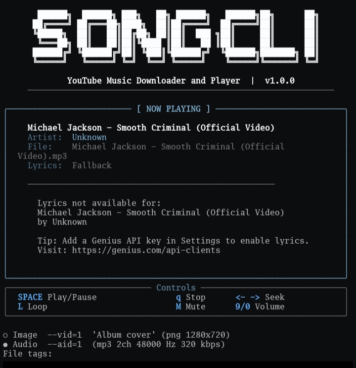
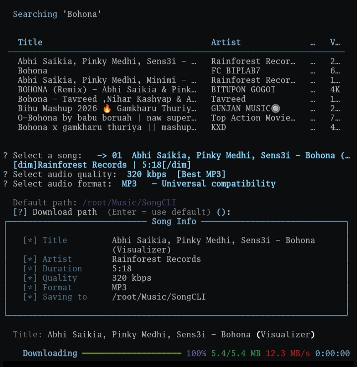

# songcli

<p align="center">
  
</p>

<p align="center">
  Terminal-based YouTube music downloader, streamer, and local music player built with Python.
</p>

<p align="center">


</p>

---

## Description

`songcli` is a terminal-based YouTube music downloader, streamer, and local audio player built using Python, yt-dlp, mpv, Rich, and InquirerPy.

It allows you to:

- Search YouTube directly from the terminal
- Download songs in multiple qualities and formats
- Stream music instantly using mpv
- Play locally downloaded songs
- Download playlists
- Track download/search history
- Detect duplicate downloads
- Customize themes and settings
- Manage playback directly from the CLI

`songcli` is designed for Linux and Termux users who want a fast, keyboard-driven music experience directly inside the terminal.

---

# Proot Distro Compatibility (Important)

`songcli` works correctly in:

- Normal Linux distributions
- Standard Termux environment

However, audio playback and streaming may fail inside Termux proot distros such as:

- Arch Linux (proot)
- Fedora (proot)
- Ubuntu (proot)
- Debian (proot)

## Why does this happen?

Proot environments are userspace container-like environments. They do not have direct access to Android's native multimedia and hardware layers.

Unlike standard Linux systems, Android uses a completely different audio architecture based on:

- AudioFlinger
- Binder IPC
- Android HAL (Hardware Abstraction Layer)

Meanwhile, Linux applications such as `mpv` expect desktop Linux audio systems like:

- ALSA
- PulseAudio
- PipeWire

Inside a proot distro:

- `/dev/snd` audio devices are unavailable
- ALSA cannot access Android speakers directly
- PipeWire usually cannot initialize properly
- mpv cannot communicate directly with Android audio drivers

Because of this, `mpv` inside proot often produces errors such as:

```text
Could not open/initialize audio device -> no sound
```
---

## Screenshots

### Main Menu

<p align="center">
  
</p>

---

### Stream Songs

<p align="center">
  
</p>

---

### Download Progress

<p align="center">
  
</p>

---

## Usage

Run the tool:

```bash
python3 songcli-1.py
```

### Features

- Download songs from YouTube
- Download playlists
- Stream music directly with mpv
- Play downloaded songs locally
- Configure output quality and format
- Search download history
- Detect duplicate downloads
- Theme customization
- yt-dlp update checker

Default download directory:

```text
~/Music/songcli
```

---

## Playback Controls

Inside mpv:

```text
SPACE   Play/Pause
q       Quit
← →    Seek
L       Toggle loop
M       Mute
9/0     Volume
```

---

## Installation

### Linux

Install system dependencies:

```bash
sudo apt update
sudo apt install python3 python3-pip ffmpeg mpv
```

Install Python dependencies:

```bash
python3 -m pip install -U yt-dlp rich InquirerPy requests
```

Run songcli:

```bash
python3 songcli-1.py
```

---

### Termux

Update packages:

```bash
pkg update && pkg upgrade
```

Install required packages:

```bash
pkg install python ffmpeg mpv pulseaudio
```

Install Python dependencies:

```bash
pip install -U yt-dlp rich InquirerPy requests
```

Run songcli:

```bash
python songcli-1.py
```

---

### Proot Distros (Arch/Fedora/Ubuntu)

Install dependencies normally inside your distro.

Example for Arch Linux:

```bash
pacman -S python python-pip ffmpeg mpv 
```

Example for Fedora:

```bash
dnf install python3 python3-pip ffmpeg mpv 
```

Install Python dependencies:

```bash
pip install -U yt-dlp rich InquirerPy requests
```
---

## Dependencies

`songcli` depends on:

- Python 3.8+
- yt-dlp
- mpv
- ffmpeg
- Rich
- InquirerPy
- requests

---

## Project Structure

```text
songcli/
│
├── songcli-1.py
├── downloads/
├── history/
├── themes/
├── docs/
│   ├── logo.png
│   └── screenshots/
│       ├── main-menu.png
│       ├── stream-songs.png
│       └── download-progress.png
```

---

## Future Plans

Planned features for future versions:

- Live synced lyrics (karaoke-style)
- Better TUI interface
- Playlist management
- Queue system
- Background playback
- Search improvements
- Animated progress bars
- Metadata editor
- Multi-threaded downloads

---

## Support

If you like this project, consider supporting it:

<p align="center">
  <a href="https://www.buymeacoffee.com/Ritusmin325k">
    
  </a>
</p>

---

## License

MIT License
